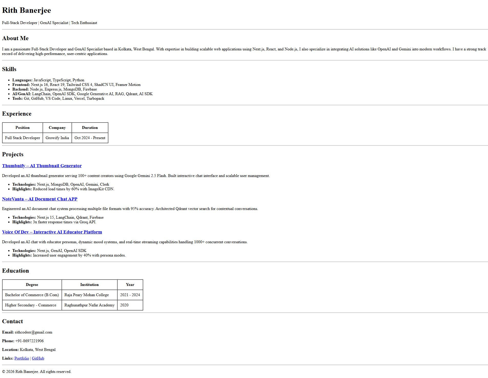

# HTML Resume

A clean, semantic, single-page HTML resume template.

## Description

This project is a simple, vertically laid-out resume built entirely with HTML5. It uses no CSS, relying on standard HTML elements (`<h1>` to `<h3>`, `
`, `<ul>`, `<table>`, `
`) for structure and readability. It is designed to be lightweight, accessible, and easily printable.

## Features

- **Semantic HTML**: Uses proper tags for headers, lists, and tables.
- **No-Code Styling**: Layout is achieved purely through HTML structure.
- **Print-Friendly**: Naturally formats well for printing or PDF conversion.
- **Project Links**: Clickable links to live projects and profiles.

## Setup

1.  Clone the repository or download the files.
2.  Locate `index.html` in the project directory.
3.  Open `index.html` in any modern web browser (Chrome, Firefox, Edge, Safari).

## Usage

To customize the resume with your own information:

1.  Open `index.html` in a code editor (VS Code, Notepad++, etc.).
2.  Navigate to the relevant section comment (e.g., `<!-- About Me Section -->`).
3.  Update the text content between the tags.
4.  Save the file and refresh your browser to see the changes.

## Structure

- **Header**: Name and Professional Title.
- **About Me**: Brief professional summary.
- **Skills**: List of technical proficiencies.
- **Experience**: Chronological work history in a table format.
- **Projects**: Key projects with descriptions and technology stacks.
- **Education**: Academic background in a table format.
- **Contact**: Contact information and social links.

## License

This project is open source and available for personal use.
